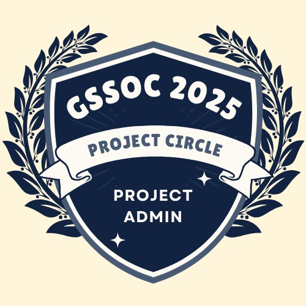

# Compassion Connect

[](https://gssoc.girlscript.tech/)

**Compassion Connect** is officially a part of **GirlScript Summer of Code 2025 (GSSoC 2025)**! 🎉  



We are excited to contribute to open-source and collaborate with the GSSoC community. 🚀


# 🌍 Compassion-Connect

## 📌 Project Description

**Compassion-Connect** is a modern, web-based **Charity and Fundraising Platform** built using **React**, **Node.js**, **Express.js**, and **MongoDB**. The platform aims to streamline donations and foster trust between donors and causes they care about.

Users can create and manage fundraising campaigns, set donation goals, and monitor progress via real-time dashboards. Donors can contribute securely through an integrated payment gateway, share campaigns on social media, and engage with the community. The app encourages transparency through clear fund allocation reports, real-time donation stats, and community-driven features like leaderboards and volunteer registration.

---

## 🚀 Features

✅ **User Authentication:** Secure registration and login for both donors and fundraisers  
✅ **Campaign Management:** Add, update, and delete campaigns with rich media and descriptions  
✅ **Payment Integration:** Seamless and secure donation processing  
✅ **Dashboard:** Real-time insights into donations, goals, and campaign performance  
✅ **Community Support:** Share campaigns, leave messages, and motivate others  
✅ **🏆 Leaderboard:** Showcases top contributors to encourage giving  
✅ **📅 Event Updates:** Live updates on ongoing and upcoming events  
✅ **🤝 Volunteer Registration:** Signup feature for volunteers to get involved  
✅ **📊 Transparent Reporting:** Track how funds are allocated and used  

---

## 🛠️ Technologies Used

### Backend

- **Node.js** – JavaScript runtime environment
- **Express.js** – Web framework for Node.js
- **MongoDB** – NoSQL database
- **Mongoose** – Object data modeling for MongoDB

### Frontend

- **React** – JavaScript library for building interactive UIs
- **React Router** – Declarative routing for React
- **Axios** – HTTP client for API requests
- **HTML5 & CSS3** – Structure and styling
- **JavaScript (ES6+)** – Dynamic client-side logic

### DevOps & Tools

- **Git & GitHub** – Version control and repository management
- **npm** – Dependency management
- **dotenv** – Environment variable configuration

---

## 📂 Project Structure

```plaintext
Compassion-Connect/
├── client/                     # React frontend
│   ├── public/                 # Static assets
│   └── src/
│       ├── assets/             # Images, icons, etc.
│       ├── components/         # Reusable React components
│       ├── pages/              # Route-based React components
│       ├── services/           # API service calls (e.g., axios)
│       ├── App.js              # App entry point
│       └── index.js            # React DOM rendering
├── server/                     # Node.js backend
│   ├── routes/                 # Express routes
│   ├── controllers/            # Route logic and middleware
│   ├── models/                 # Mongoose models
│   ├── config/                 # DB connection and config files
│   └── app.js                  # Main Express app
├── .env                        # Environment variables
├── .gitignore                  # Git ignored files
├── package.json                # Backend dependencies
├── README.md                   # Project documentation
└── package-lock.json           # Lock file for dependencies
```

---

## 🛠️ Installation Instructions

### Prerequisites

* Node.js and npm installed
* MongoDB instance (local or cloud)
* Git

## 🤝 How to Contribute

We welcome all contributions to improve the platform! 🎉

### 🧾 Steps to Contribute

1. **Fork** this repository
2. **Clone** your fork to your local machine:

   ```bash
   git clone https://github.com/<your-username>/Compassion-Connect.git
   ```
3. **Create a new branch** for your feature or fix:

   ```bash
   git checkout -b feature/my-awesome-feature
   ```
4. **Make your changes** and **commit**:

   ```bash
   git add .
   git commit -m "Add: My awesome feature"
   ```
5. **Push** to your forked repo:

   ```bash
   git push origin feature/my-awesome-feature
   ```
6. **Create a Pull Request** from your fork's branch into the main project

---

## 📬 Contact

For issues or feature suggestions, feel free to open an [issue](https://github.com/SrijaVuppala295/Compassion-Connect/issues).

Let's build a better world through tech. ❤️
